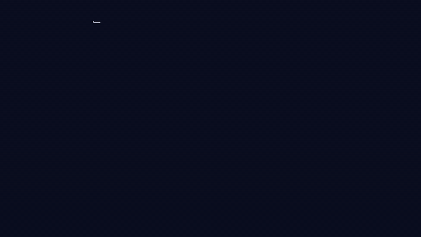
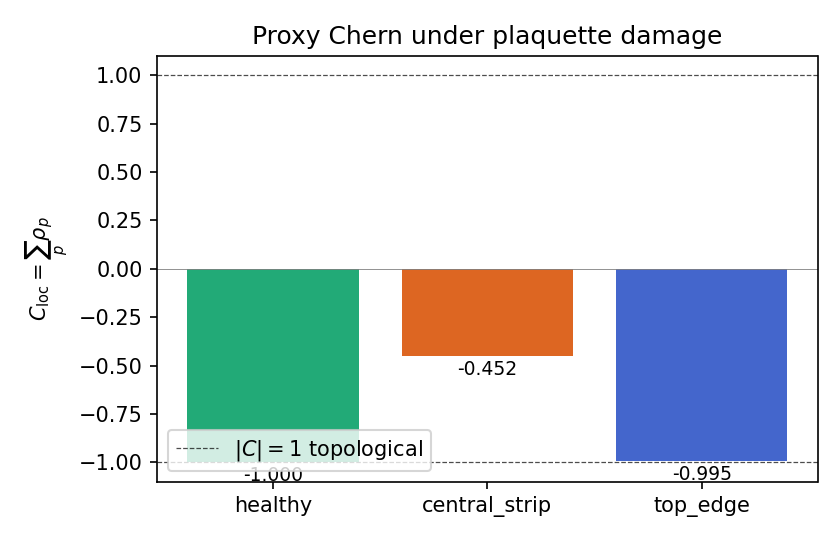
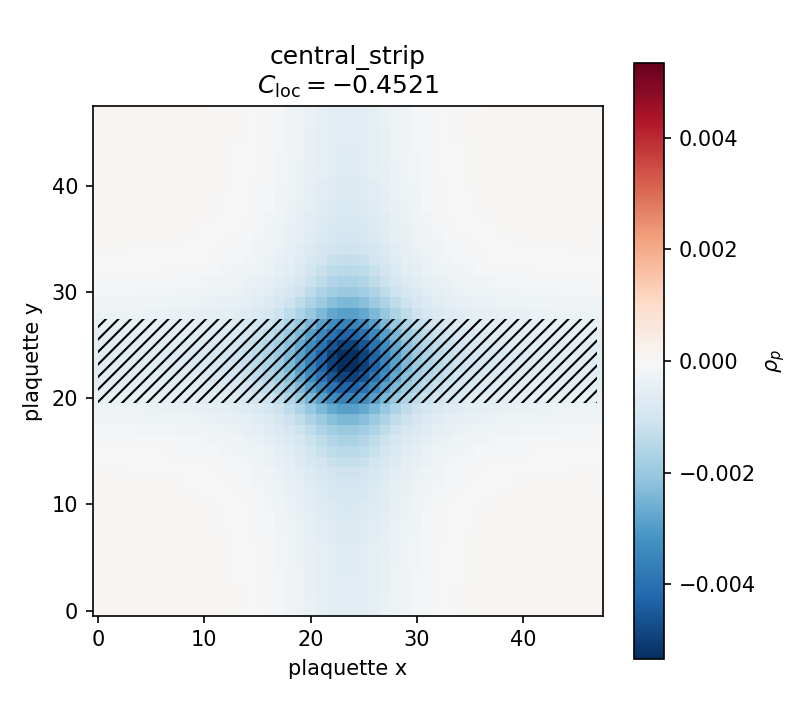

# Local Plaquette-Flux Proxy Chern

**ID:** `eq-local-plaquette-flux-proxy-chern`
**Tier:** gold (score 92) · **Units:** OK · **Theory:** PASS-WITH-ASSUMPTIONS



$$
\rho_p \;=\; \frac{1}{2\pi}\,\arg\!\Big(g_{p,0}\,g_{p,1}\,\overline{g_{p,2}}\,\overline{g_{p,3}}\Big),
\qquad
C_{\mathrm{loc}} \;=\; \sum_p \rho_p .
$$

A solver-backed local plaquette-flux density and summed proxy Chern for
damaged HAFC / EGATL lattices. With $g_{p,k}$ taken as the link
variables $U_b = \langle\psi_a|\psi_b\rangle / |\langle\psi_a|\psi_b\rangle|$
of a Bloch band on a closed Brillouin-zone torus, the equation reduces
to the **Fukui–Hatsugai–Suzuki** lattice Chern formula, which produces
**exactly an integer** at any finite mesh size. On a damaged finite
lattice it is no longer integer-quantised, but it remains a **local,
bounded, masked-summable** topological proxy.

See [`derivations/proxy_chern_derivation.md`](derivations/proxy_chern_derivation.md) for the full derivation.

## Repository layout

```
simulations/
    plaquette_chern.py     # core observable: link variables, plaquette flux, proxy Chern
    run_scenarios.py       # healthy / central-strip-damage / top-edge-damage scenarios
animations/
    proxy_chern_hero.py    # Manim scene that produced images/proxy_chern_hero.gif
tests/
    test_plaquette_chern.py
derivations/
    proxy_chern_derivation.md
notes/
    references.md
data/                       # CSV outputs from run_scenarios.py
images/                     # PNG outputs from run_scenarios.py + the hero GIF/MP4
requirements.txt
```

## Quickstart

```powershell
python -m pip install -r requirements.txt
python -m pytest tests -q
python simulations/run_scenarios.py
```

The scenario runner prints a summary, writes per-plaquette data to
`data/<label>_rho_p.csv`, and saves heatmaps + a comparison bar chart
under `images/`.

## Reference results

Discretised Brillouin zone of the Qi–Wu–Zhang lattice Chern insulator
$H(\mathbf k) = \sin k_x\sigma_x + \sin k_y\sigma_y + (m + \cos k_x + \cos k_y)\sigma_z$,
$L = 48$, $m = -1.5$ (topological phase, $|C| = 1$):

| Scenario        | Plaquettes kept | $C_{\mathrm{loc}}$            |
|-----------------|-----------------|--------------------------------|
| `healthy`       | 2304 / 2304     | $\mathbf{-1.000000}$ (FHS-quantised exactly) |
| `central_strip` | 1920 / 2304     | $-0.452$                       |
| `top_edge`      | 2208 / 2304     | $-0.995$                       |

The sign is gauge-arbitrary (per-site `numpy.linalg.eigh` chooses an
arbitrary phase); the magnitude $|C| = 1$ is the topological content.
A central strip excises plaquettes near the Berry-curvature
concentration and removes ~55 % of the topological signal; a thin
top-edge cut removes negligible weight, as expected from a proxy that
retains *where* the topological density lives.





## Tests

`python -m pytest tests -q` runs six checks:

- $\rho_p = 0$ for trivial unit links.
- $\rho_p \in (-\tfrac12, \tfrac12]$ for arbitrary unit-modulus
  $g_{p,k}$.
- $|C| = 1$ exactly in the topological phase ($m = -1.5$).
- $C = 0$ exactly in the trivial phase ($m = -3$).
- Central-strip damage shifts $|C|$ by an $\mathcal O(1)$ amount.
- A thin top-edge cut perturbs $C$ by *less* than a wide central strip.

## Plugging in HAFC / EGATL solver output

Use the same observable on user-supplied bond responses:

```python
import numpy as np
from plaquette_chern import plaquette_g, plaquette_flux, proxy_chern

# Ux, Uy: complex arrays of shape (Lx, Ly), unit-modulus link variables
# Optional mask: bool array of shape (Lx, Ly) with False on damaged plaquettes
g     = plaquette_g(Ux, Uy)
rho

## Hero animation

The hero GIF at the top of this README is generated by the Manim scene in
[`animations/proxy_chern_hero.py`](animations/proxy_chern_hero.py). It
reuses the same `plaquette_chern.py` module that powers the simulations
and tests, so what you see is the actual physics: real ρ_p values
(diverging palette), exact FHS quantisation as the wave fills, the
central-strip damage event, and the heal-back.

Re-render with::

    manim -qh --disable_caching animations/proxy_chern_hero.py ProxyChernHero

To produce a small GitHub-friendly GIF after rendering the MP4::

    ffmpeg -y -i media/videos/proxy_chern_hero/1080p60/ProxyChernHero.mp4 \
        -vf "fps=18,scale=720:-1:flags=lanczos,palettegen=stats_mode=full" _palette.png
    ffmpeg -y -i media/videos/proxy_chern_hero/1080p60/ProxyChernHero.mp4 -i _palette.png \
        -lavfi "fps=18,scale=720:-1:flags=lanczos[v];[v][1:v]paletteuse=dither=bayer:bayer_scale=5" \
        images/proxy_chern_hero.gif_p = plaquette_flux(g)
C_loc = proxy_chern(rho_p, mask=mask)
```

## Links

- TopEquations registry: https://rdm3dc.github.io/TopEquations/registry.html#eq-local-plaquette-flux-proxy-chern
- TopEquations main repo: https://github.com/RDM3DC/TopEquations
- Certificates: https://rdm3dc.github.io/TopEquations/certificates.html

---
*Part of the [TopEquations](https://github.com/RDM3DC/TopEquations) project.*
# Local Plaquette-Flux Proxy Chern

**ID:** `eq-local-plaquette-flux-proxy-chern`  
**Tier:** derived  
**Score:** 92  
**Units:** OK  
**Theory:** PASS-WITH-ASSUMPTIONS  

## Equation

$$
\rho_p=\frac{1}{2\pi}\arg\!\big(g_{p,0}g_{p,1}\,\overline{g_{p,2}}\,\overline{g_{p,3}}\big),\quad C_{\mathrm{loc}}=\sum_p \rho_p
$$

## Description

Solver-backed local plaquette-flux density and summed proxy Chern for damaged HAFC/EGATL lattices. This makes the previously abstract local Chern signal computable from an oriented plaquette product, giving a scalable post-damage topological proxy when dense Bott-style postprocessing becomes impractical.

## Assumptions

- Plaquette bond ordering and orientation are fixed consistently so the oriented plaquette product is comparable across runs.
- The complex bond responses g_{p,k} remain defined on the monitored plaquettes, and the plaquette-product phase is interpreted on a principal branch before summation.
- C_{\mathrm{loc}} is used as a scalable proxy diagnostic on damaged finite lattices, not claimed to be an exactly quantized Bott invariant in every finite-size regime.
- The same local phase convention and damage protocol are used when comparing healthy, central-strip, and top-edge runs.

## Repository Structure

```
images/       # Visualizations, plots, diagrams
derivations/  # Step-by-step derivations and proofs
simulations/  # Computational models and code
data/         # Numerical data, experimental results
notes/        # Research notes and references
```

## Links

- [TopEquations Registry](https://rdm3dc.github.io/TopEquations/registry.html)
- [TopEquations Main Repo](https://github.com/RDM3DC/TopEquations)
- [Certificates](https://rdm3dc.github.io/TopEquations/certificates.html)

---
*Part of the [TopEquations](https://github.com/RDM3DC/TopEquations) project.*
